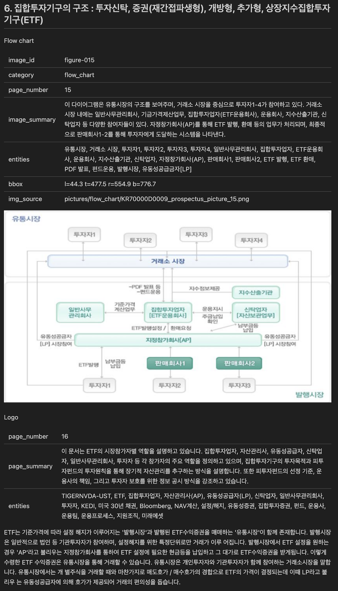
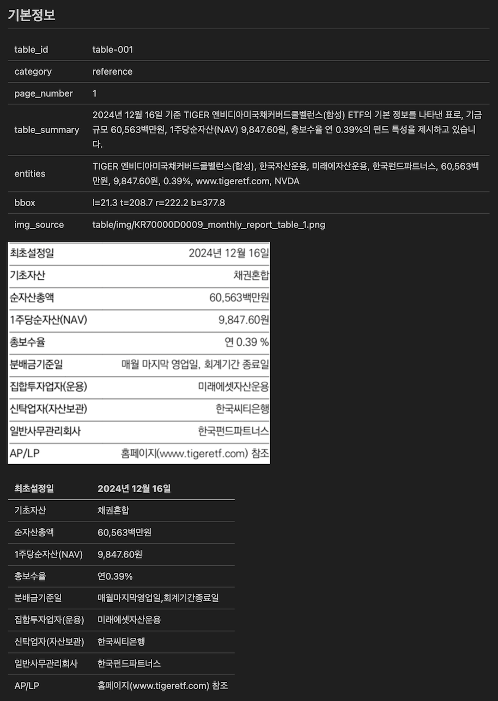
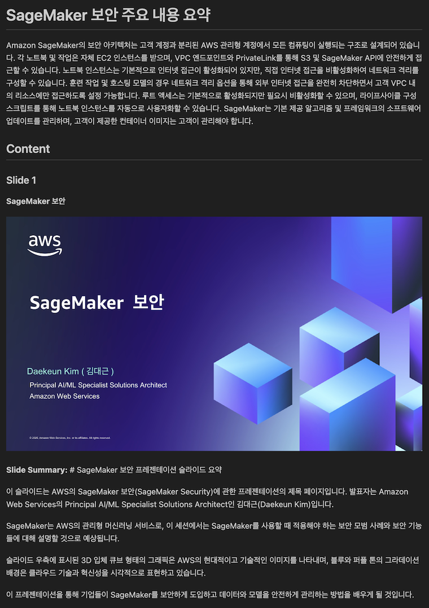
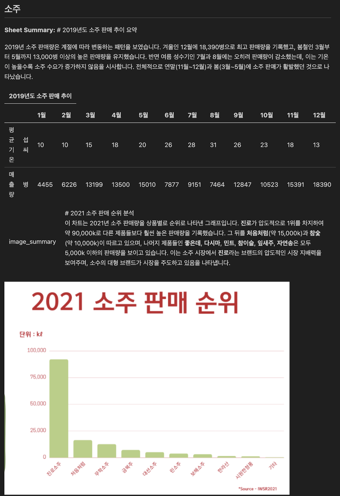

# Amazon Bedrock Document Parser

PDF 및 Office(docx, pptx, xlsx) 문서에서 텍스트, 테이블, 이미지를 추출하고 AWS Bedrock 멀티모달 LLM으로 요약/엔티티를 생성하는 통합 도구입니다.
단일 파일 또는 폴더 내 문서 일괄 병렬 파싱을 지원하며, 파일 확장자에 따라 PDF / Office 파서를 자동 선택합니다.

## Why?

RAG(Retrieval-Augmented Generation) 파이프라인에서 가장 중요한 첫걸음은 **비정형 문서를 얼마나 정확하게 파싱하느냐**입니다.

실제 기업 환경의 문서는 단순 텍스트가 아닙니다. PDF에는 복잡한 테이블과 차트가 포함되어 있고, PowerPoint는 슬라이드별로 이미지와 다이어그램이 혼재하며, Excel은 여러 시트에 걸쳐 수식과 병합 셀이 얽혀 있습니다. 이러한 비정형 데이터를 제대로 파싱하지 않으면, 아무리 좋은 임베딩 모델과 LLM을 사용하더라도 RAG의 품질은 근본적으로 제한됩니다.

흔히 이 단계를 가볍게 여기거나 GenAI 모델에 전적으로 의존하는 경우가 있지만, 이는 명확한 한계가 있습니다. LLM은 테이블의 셀 구조를 정밀하게 인식하지 못하고, 이미지 내 텍스트를 놓치며, 문서의 레이아웃 정보(위치, 페이지 번호 등)를 보존하지 못합니다. 결국 **"Garbage In, Garbage Out"** — 파싱 품질이 전체 RAG 파이프라인의 상한선을 결정합니다.

물론 상용 문서 파싱 솔루션도 존재하지만, 다음과 같은 이유로 자체 구축이 필요한 경우가 많습니다:

- **도메인 특화**: 금융 보고서, 의료 문서, 기술 매뉴얼 등 도메인별 문서 구조에 맞는 커스터마이징이 필요
- **보안/컴플라이언스**: 민감한 내부 문서를 외부 SaaS로 전송할 수 없는 환경
- **파이프라인 통합**: 기존 데이터 파이프라인에 유연하게 통합하고 출력 형식을 제어해야 하는 경우
- **비용 최적화**: 대량 문서 처리 시 API 호출 비용 대비 자체 파싱이 경제적

이 프로젝트는 이러한 요구사항을 해결하기 위한 **production-ready 문서 파싱의 첫걸음**입니다. Docling 기반의 정밀한 PDF 파싱, AST 기반의 구조화된 Office 파싱, 그리고 Bedrock LLM을 활용한 지능형 요약을 하나의 통합 도구로 제공합니다.

## 주요 기능

### PDF 파서 (`pdf_parser/`)
- **PDF 파싱**: [Docling](https://github.com/DS4SD/docling) 기반 고품질 PDF 변환
- **요소 추출**: 텍스트, 테이블, 이미지 자동 분리 + 바운딩 박스 위치 정보
- **이미지 분류**: DocumentFigureClassifier(EfficientNet-B0)로 16가지 카테고리 자동 분류
- **AI 요약**: AWS Bedrock Claude로 페이지/이미지/테이블별 요약 + 엔티티 추출
- **테이블 분석**: TableFormer 모델로 셀 구조 분석 + LLM 카테고리 분류
- **HTML 메타데이터**: 파싱 결과를 구조화된 HTML 테이블 태그로 출력

### Office 파서 (`office_parser/`)
- **다중 포맷 지원**: docx, pptx, xlsx, odt, odp, ods, rtf
- **AST 기반 파싱**: 문서를 구조화된 AST(Abstract Syntax Tree)로 변환
- **다양한 출력**: JSON, Markdown, HTML, Text 형식 지원
- **이미지/차트 추출**: 첨부 이미지 및 차트 데이터 자동 추출
- **AI 요약**: AWS Bedrock Claude로 이미지/슬라이드 요약

### 공통
- **자동 분기**: 파일 확장자에 따라 PDF / Office 파서 자동 선택
- **일괄 처리**: 폴더 내 문서를 `ProcessPoolExecutor`로 병렬 파싱
- **로그 저장**: `log/` 디렉토리에 실행 시각별 `.log` 파일 자동 생성

## 프로젝트 구조

```
doc-parser/
├── run.py                        # 통합 CLI 진입점 (PDF + Office)
├── pdf_parser/                   # PDF 파서 모듈
│   ├── __init__.py
│   ├── utils.py                  # bbox/위치 정보 헬퍼
│   ├── converter.py              # DoclingConverter, ParsedDocument
│   ├── summarizer.py             # BedrockSummarizer (병렬 LLM 요약)
│   └── markdown_builder.py       # MarkdownBuilder (HTML 메타 테이블 + 마크다운 조립)
├── office_parser/                # Office 파서 모듈
│   ├── __init__.py
│   ├── parser.py                 # OfficeParser (docx/pptx/xlsx/odt/rtf 파싱)
│   ├── types.py                  # 데이터 타입 정의 (AST, Config, Node 등)
│   └── worker.py                 # 단일 파일 파싱 워커
├── pdf_parser_docling.ipynb      # PDF 인터랙티브 노트북
├── log/                          # 실행 로그 (gitignore)
├── pyproject.toml                # uv 프로젝트 설정
└── README.md
```

## 설치

```bash
uv sync
```

> **Apple Silicon**: DocumentFigureClassifier는 EfficientNet-B0 기반으로 CPU에서도 빠르게 동작합니다.

## 환경 설정

AWS Bedrock 접근을 위한 자격 증명이 필요합니다:

```bash
# AWS CLI 설정
aws configure

# 또는 환경 변수
export AWS_ACCESS_KEY_ID=your_access_key
export AWS_SECRET_ACCESS_KEY=your_secret_key
export AWS_DEFAULT_REGION=us-east-1
```

## 사용법

### CLI (run.py)

```bash
# ── PDF ──
# 단일 PDF 파싱
uv run python run.py sample.pdf -o output

# 빠른 테이블 모드
uv run python run.py sample.pdf -o output --table-mode fast

# ── Office ──
# 단일 Office 파일 (마크다운 출력)
uv run python run.py report.docx -o output --to-markdown

# HTML 출력
uv run python run.py slides.pptx -o output --to-html

# ── 공통 ──
# 폴더 내 문서 일괄 병렬 처리 (PDF + Office 혼합 가능)
uv run python run.py ./docs/ -o output --workers 4

# LLM 요약 없이 추출만
uv run python run.py sample.pdf -o output --no-summary

# Bedrock 모델/리전 변경
uv run python run.py sample.pdf -o output --model-id us.anthropic.claude-3-5-sonnet-20241022-v2:0
uv run python run.py report.docx -o output --bedrock-region us-west-2

# 상세 로그 출력
uv run python run.py sample.pdf -o output -v
```

### CLI 옵션

| 옵션 | 기본값 | 설명 |
|------|--------|------|
| `input` | (필수) | 파일 또는 폴더 경로 |
| `-o`, `--output` | `output` | 출력 디렉토리 |
| `--workers` | `2` | 폴더 모드 시 병렬 처리 수 |
| `--no-summary` | `false` | LLM 요약 비활성화 |
| `--model-id` | `claude-haiku-4-5` | Bedrock 모델 ID |
| `--table-mode` | `accurate` | PDF TableFormer 모드 (`accurate` / `fast`) |
| `--to-markdown` | (기본) | Office 출력: Markdown |
| `--to-html` | | Office 출력: HTML |
| `--to-text` | | Office 출력: Text |
| `--bedrock-region` | `us-east-1` | Bedrock 리전 |
| `-v`, `--verbose` | `false` | DEBUG 로그 출력 |

### Python 코드에서 직접 사용

#### PDF 파싱

```python
from pdf_parser.converter import DoclingConverter
from pdf_parser.summarizer import BedrockSummarizer
from pdf_parser.markdown_builder import MarkdownBuilder
from pathlib import Path

# 1) PDF 변환
converter = DoclingConverter(table_mode="accurate")
parsed = converter.convert("sample.pdf")

# 2) 에셋 저장
output_dir = Path("output/sample")
output_dir.mkdir(parents=True, exist_ok=True)
parsed.save_assets(output_dir)

# 3) LLM 요약 (선택)
summarizer = BedrockSummarizer(model_id="us.anthropic.claude-3-5-sonnet-20241022-v2:0")
page_summaries = summarizer.summarize_pages(parsed)
image_summaries = summarizer.summarize_figures(parsed, page_summaries)
table_summaries = summarizer.summarize_tables(parsed, page_summaries)

# 4) 최종 마크다운 생성
builder = MarkdownBuilder(parsed, output_dir)
final_md = builder.build(page_summaries, image_summaries, table_summaries)
Path("output/sample/sample_final.md").write_text(final_md, encoding="utf-8")
```

#### Office 파싱

```python
from office_parser import OfficeParser, OfficeParserConfig

# 1) 설정
config = OfficeParserConfig(
    summarize=True,
    bedrock_model_id="us.anthropic.claude-haiku-4-5-20251001-v1:0",
)

# 2) 파싱
ast = OfficeParser.parse_office("report.docx", config)

# 3) 출력 변환
markdown = ast.to_markdown()
html = ast.to_html()
text = ast.to_text()
```

## 출력 예시

### PDF

PDF 파싱 결과는 원본 문서의 구조를 최대한 보존하면서, 각 요소(페이지/이미지/테이블)에 대한 메타데이터를 HTML 테이블 태그로 삽입합니다.

**이미지 파싱 결과:**



- 문서 내 이미지를 자동 감지하고 EfficientNet-B0 기반 분류기로 16가지 카테고리(bar_chart, flow_chart, screenshot 등)를 판별합니다.
- 바운딩 박스(bbox) 좌표를 추출하여 이미지의 페이지 내 정확한 위치 정보를 제공합니다.
- Bedrock Claude API를 호출하여 이미지 요약과 엔티티를 생성하며, 이때 해당 이미지가 속한 페이지의 요약을 컨텍스트로 함께 전달하여 더 정확한 요약을 생성합니다.

**테이블 파싱 결과:**



- TableFormer 모델로 테이블의 셀 구조(행/열/병합)를 정밀하게 분석하고, 마크다운 테이블로 변환합니다.
- 테이블 영역 이미지를 별도 저장하고, Bedrock Claude API로 테이블 내용 요약 + 카테고리 분류(financial_statement, comparison, statistics 등)를 수행합니다.
- 페이지 요약을 컨텍스트로 제공하여 테이블의 맥락을 반영한 요약을 생성하며, 바운딩 박스로 테이블의 위치 정보도 함께 기록합니다.

### PowerPoint



- PowerPoint 문서를 AST(Abstract Syntax Tree) 형태로 파싱하여 슬라이드 → 텍스트/이미지/표의 계층 구조를 유지합니다.
- 각 슬라이드의 제목, 본문, 노트를 구분하여 마크다운 헤딩/리스트로 정렬하고, 첨부 이미지는 `pictures/` 폴더에 저장 후 상대 경로로 참조합니다.
- LibreOffice가 설치된 환경에서는 슬라이드를 이미지로 렌더링하여 Bedrock Claude API로 슬라이드별 시각적 요약을 생성합니다.

### Excel



- 시트별로 테이블 데이터를 마크다운 테이블로 변환하며, 셀 병합/수식 결과값도 정확하게 반영합니다.
- 여러 시트가 있는 경우 시트 이름을 헤딩으로 구분하여 문서 구조를 유지하고, Bedrock Claude API로 시트별 요약을 병렬 생성합니다.

## 지원 파일 형식

| 형식 | 확장자 | 파서 |
|------|--------|------|
| PDF | `.pdf` | `pdf_parser` (Docling) |
| Word | `.docx` | `office_parser` |
| PowerPoint | `.pptx` | `office_parser` |
| Excel | `.xlsx` | `office_parser` |
| OpenDocument | `.odt`, `.odp`, `.ods` | `office_parser` |
| RTF | `.rtf` | `office_parser` |

## 출력 구조

PDF와 Office 모두 동일한 디렉토리 구조로 출력됩니다:

```
output/{파일명}/
├── {파일명}.md (또는 _final.md)  # 최종 마크다운
├── pictures/                     # 추출된 이미지
│   ├── image1.png
│   └── ...
└── table/                        # (PDF만) 테이블 에셋
    ├── img/                      # 테이블 영역 이미지
    └── md/                       # 테이블 마크다운
```

## PDF 출력 마크다운 형식

최종 마크다운(`_final.md`)은 구조화된 HTML 메타데이터 테이블을 포함합니다:

- **페이지 메타데이터** (`<table class="page-meta">`): `page_number`, `page_summary`, `entities`
- **이미지 메타데이터** (`<table class="figure-meta">`): `image_id`, `category`, `page_number`, `image_summary`, `entities`, `bbox`, `img_source`
- **테이블 메타데이터** (`<table class="table-meta">`): `table_id`, `category`, `page_number`, `table_summary`, `entities`, `bbox`, `img_source`

## 이미지 분류 카테고리 (16종)

`bar_chart` · `bar_code` · `chemistry_markush_structure` · `chemistry_molecular_structure` · `flow_chart` · `icon` · `line_chart` · `logo` · `map` · `other` · `pie_chart` · `qr_code` · `remote_sensing` · `screenshot` · `signature` · `stamp`

## 테이블 카테고리 (LLM 분류)

`financial_statement` · `comparison` · `statistics` · `performance_metrics` · `configuration` · `schedule` · `pricing` · `inventory` · `survey_results` · `reference` · `other`

## 로깅

실행 시 `log/` 디렉토리에 타임스탬프 기반 로그 파일이 자동 생성됩니다:

```
log/
├── 20260311_221500.log
├── 20260311_223000.log
└── ...
```

로거 네임스페이스:
- `doc_parser` — 메인 CLI (파일 탐색, 전체 결과 요약)
- `pdf_parser` — PDF 파싱 관련
- `office_parser` — Office 파싱 관련

## 요구사항

- Python 3.12+
- AWS 계정 (Bedrock Claude 모델 액세스)
- macOS / Linux (Windows는 WSL 권장)
- Office 파서의 슬라이드 이미지 변환 시 LibreOffice 필요 (선택)

### LibreOffice 설치 (선택)

PowerPoint 슬라이드를 이미지로 변환하여 AI 요약을 생성할 때 필요합니다. 설치하지 않아도 텍스트 기반 파싱은 정상 동작합니다.

```bash
# macOS
brew install --cask libreoffice

# Ubuntu / Debian
sudo apt install libreoffice

# Amazon Linux / RHEL
sudo yum install libreoffice
```

## MCP 서버

이 프로젝트는 [FastMCP](https://gofastmcp.com) 기반 MCP(Model Context Protocol) 서버를 제공합니다. Claude Desktop, Kiro, Cursor 등 MCP 클라이언트에서 문서 파싱 기능을 직접 호출할 수 있습니다.

### 제공 Tool

| Tool | 설명 |
|------|------|
| `parse_document` | 단일 문서(PDF/Office) 파싱 → 마크다운/HTML/텍스트 출력 |
| `parse_directory` | 폴더 내 문서 일괄 병렬 파싱 |
| `list_supported_formats` | 지원 형식 목록 조회 |

### 실행 방법

```bash
# stdio 모드 (기본 — MCP 클라이언트용)
uv run python mcp_server.py

# streamable-http 모드 (HTTP 기반 클라이언트용)
uv run python mcp_server.py http

# 호스트/포트 변경
MCP_HOST=127.0.0.1 MCP_PORT=9000 uv run python mcp_server.py http
```

### MCP 클라이언트 설정

#### Claude Desktop

`~/Library/Application Support/Claude/claude_desktop_config.json`:

```json
{
  "mcpServers": {
    "doc-parser": {
      "command": "uv",
      "args": ["run", "python", "mcp_server.py"],
      "cwd": "/path/to/doc-parser"
    }
  }
}
```

#### Kiro

`.kiro/settings/mcp.json`:

```json
{
  "mcpServers": {
    "doc-parser": {
      "command": "uv",
      "args": ["run", "python", "mcp_server.py"],
      "cwd": "/path/to/doc-parser"
    }
  }
}
```

#### Streamable HTTP 클라이언트

`uv run python mcp_server.py http`로 서버를 먼저 실행한 후, 클라이언트에서 URL로 연결합니다.

Claude Desktop (`claude_desktop_config.json`):

```json
{
  "mcpServers": {
    "doc-parser": {
      "url": "http://localhost:8000/mcp"
    }
  }
}
```

Kiro (`.kiro/settings/mcp.json`):

```json
{
  "mcpServers": {
    "doc-parser": {
      "url": "http://localhost:8000/mcp"
    }
  }
}
```

### MCP Inspector로 테스트

#### stdio 모드

```bash
MCP_SERVER_REQUEST_TIMEOUT=600000 npx @modelcontextprotocol/inspector uv run python mcp_server.py
```

#### streamable-http 모드

```bash
# 터미널 1: 서버 실행
uv run python mcp_server.py http

# 터미널 2: Inspector 실행
npx @modelcontextprotocol/inspector
```

Inspector UI(`http://localhost:6274`)에서:
1. Transport Type → `Streamable HTTP` 선택
2. URL에 `http://localhost:8000/mcp` 입력
3. Advanced Configuration에서 Request Timeout / Maximum Total Timeout을 `600000`(10분)으로 변경
4. Connect → Tools 탭에서 테스트

#### curl로 테스트

```bash
# tool 목록 조회
curl -X POST http://localhost:8000/mcp \
  -H "Content-Type: application/json" \
  -H "Accept: application/json, text/event-stream" \
  -d '{"jsonrpc":"2.0","id":1,"method":"tools/list"}'

# 단일 문서 파싱
curl -X POST http://localhost:8000/mcp \
  -H "Content-Type: application/json" \
  -H "Accept: application/json, text/event-stream" \
  -d '{"jsonrpc":"2.0","id":2,"method":"tools/call","params":{"name":"parse_document","arguments":{"file_path":"/path/to/document.pdf","no_summary":true}}}'

# 폴더 내 문서 일괄 파싱
curl -X POST http://localhost:8000/mcp \
  -H "Content-Type: application/json" \
  -H "Accept: application/json, text/event-stream" \
  -d '{"jsonrpc":"2.0","id":3,"method":"tools/call","params":{"name":"parse_directory","arguments":{"dir_path":"/path/to/docs/","workers":4,"no_summary":true}}}'
```

## 라이선스

이 프로젝트는 MIT 라이선스로 자유롭게 수정 및 배포 가능합니다. 자세한 내용은 LICENSE 파일을 참조해 주시기 바랍니다.